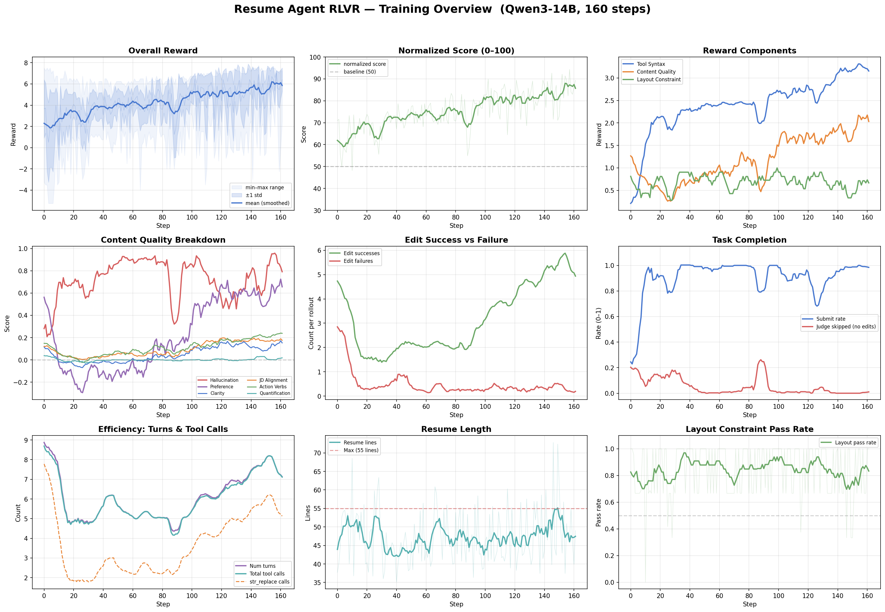
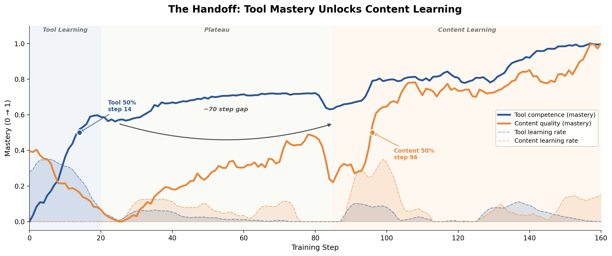
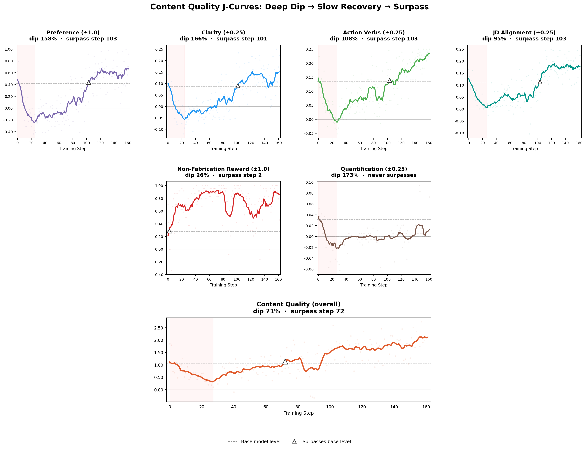
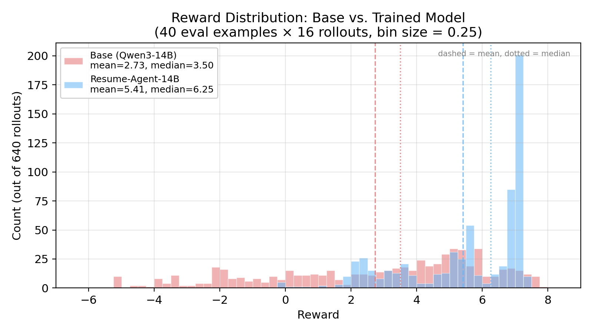
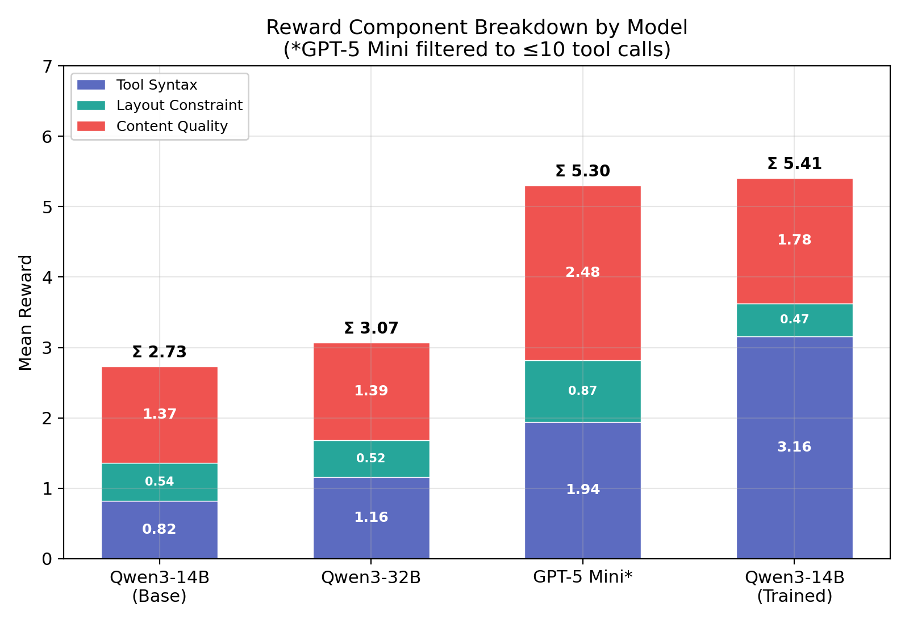
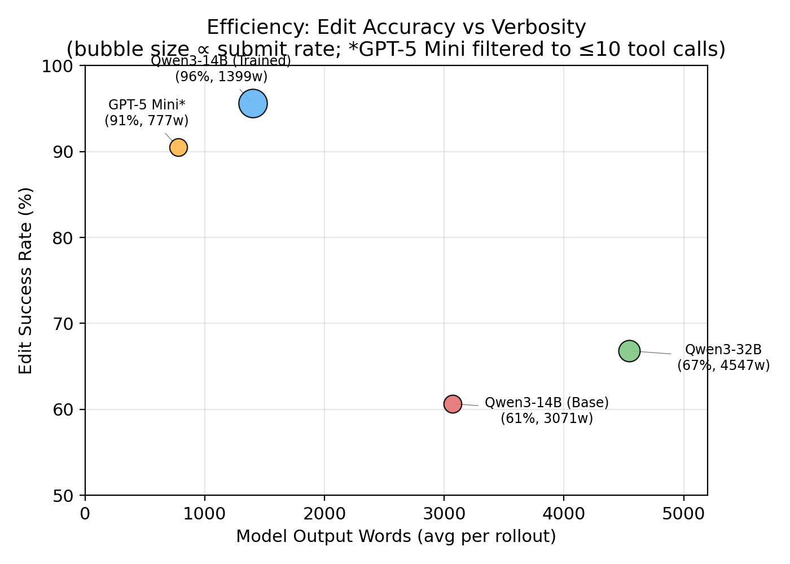
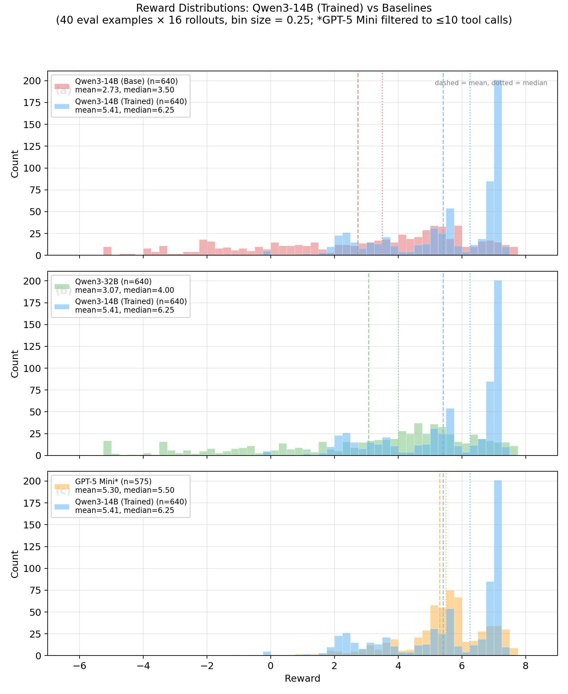
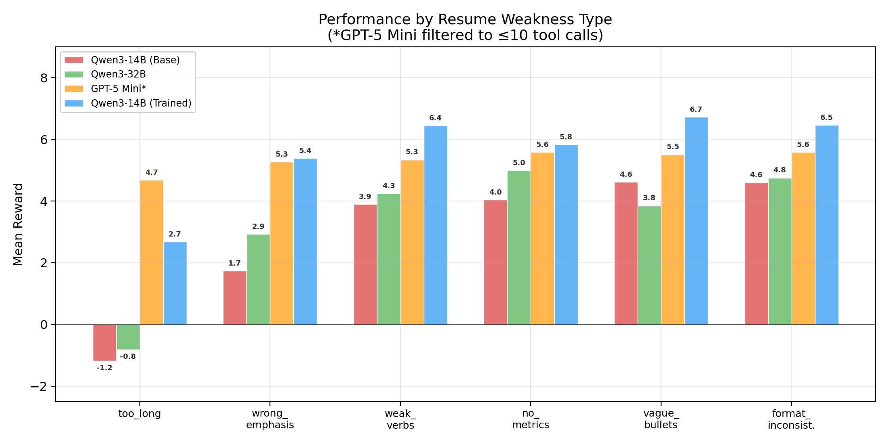

+++
date = '2026-04-07T00:00:00-07:00'
draft = false
title = 'Can Coding Agents Learn Editorial Taste with RLVR?'
summary = 'Training a Qwen3-14B resume revision agent with RLVR and an LLM judge. Tool mastery comes fast, content quality learns slow, and the rubric tensions reveal what reward design really means for creative domains.'
tags = ['RLVR', 'reinforcement learning', 'agents', 'LLM']
ShowToc = true
TocOpen = false
+++

Coding agent architectures like Codex, Claude Code, and Cursor are capable of generalizing much beyond code. The core components of these modern agentic harnesses are essentially a persistent file system, an interactive shell, and a set of function schemas for content editing. It's like giving the foundation models a working computer, which lets them do any daily professional work on a real machine. Anthropic's Cowork is a great early example of this idea: the same agentic harness used to edit code starts editing spreadsheets and slide decks, and soon the industry will follow.

Yet, a clear end-to-end training recipe for this broader professional editing workflow hasn't been publicly demonstrated. Coding agents are post-trained in an RLVR paradigm inherited from the reasoning model era, where the results are cheaply verifiable. But optimizing for content quality isn't something you can write a unit test for. Conventional methods like SFT and DPO can learn generation style and alignment, but don't account for the evolving, stateful environment underneath. Ultimately, the model makes sequential edits via tool calls, and quality emerges from the full trajectory, framing it as a strategic planning problem RLVR is built to optimize.

To make this end-to-end RLVR pipeline trainable under current agentic harnesses, we need to make the model's subjective editorial judgment, the "taste", verifiable. LLM-as-a-judge could be a natural fit here: it can provide categorical grading on the content metrics we care about, and we add them up as a reward scalar for GRPO-based algorithms to differentiate and reinforce. To test this, I trained a Qwen3-14B agent on resume revisions — a task domain with real format constraints, domain rules, and editorial decisions — using RLVR with an LLM judge. The result shows unmistakable learning signal with revealing dynamics: an emergent curriculum between tool use and content quality, and intrinsic tensions over which content dimensions get reinforced and which don't.

**[Code, environment, data, and training configs](https://github.com/KaiwenChe/rlvr_resume_agent)**

---

## Task Setup

### Data: synthetic resumes with planted weaknesses

Real resumes paired with real job descriptions would be ideal, but getting them at scale means scraping, cleaning, and navigating privacy and copyright problems that aren't worth the distraction for a proof of concept. So the dataset is fully synthetic: 200 resume-JD pairs generated by Gemini 3 Pro for content fidelity, split 160/40 train/eval.

Each data point starts as a randomly sampled persona: role, seniority, industry vertical, tech stack, education, company history. The diversity matrix is wide enough (19 roles × 6 seniority levels × 39 verticals) that the model can't memorize its way through. The persona seeds both a resume and a matched job description that the candidate would plausibly apply to.

The key design choice is weakness injection. Each resume is assigned one of six weakness types that represent common failure modes a revision agent should learn to fix: 

- **`vague_bullets`** — generic phrasing that lacks specificity
- **`no_metrics`** — real accomplishments with zero quantification
- **`too_long`** — good content that exceeds an established page limit
- **`wrong_emphasis`** — relevant experience buried or undersold for the target role
- **`weak_verbs`** — passive constructions that diminish impact
- **`formatting_inconsistent`** — mixed date formats, bullet styles, header levels

The generation prompt mixes roughly 60% weak and 40% strong bullets within each resume, so the documents feel like real people being inconsistent rather than uniformly bad. The agent needs to learn to identify *which* bullets to fix rather than a blanket rewrite.

The weakness metadata doesn't appear in the agent's prompt. It sees only the JD and resume and has to figure out what to improve on its own. But the metadata reaches the judge rubric as ground truth context, letting it assess whether the agent actually addressed the specific weakness present. The agent learns to diagnose without labels; the reward signal is informed by them.

### Environment: simplified coding agent harness

The task is a deliberate simplification of how real coding agents work. Claude Code or Codex would first locate the relevant file, read it into context, then start editing. I skip the retrieval phase, so the agent receives its system instruction, the target JD, and the resume in Markdown at rollout start, as if it had already opened the file. This collapses the problem to the part I actually wanted to train: multi-turn agentic editing with tool use, layout constraints, and content quality judgment.

The page constraint is a 55-line limit with auto-wrapping at 165 characters per line — my proxy for a standard-formatted one-page resume. The agent gets a 10-turn budget and three tools, limited to one tool call per turn:

- **`str_replace(old, new, count)`** — the primary editing tool, modeled after the search-and-replace pattern in coding agents. The agent passes an `old` string to locate in the resume and a `new` string to replace it with. On success, it returns a unified diff of what changed plus current layout stats (line count, max line length). On failure (`old` not found, or multiple ambiguous matches), it returns an error describing what went wrong.
- **`review()`** — shows the full current resume with constraint status: line count versus the 55-line limit, and an overflow delimiter if over.
- **`submit()`** — finalizes the revision and ends the session for grading.

Every tool response includes a meta-line with turns remaining and cumulative edit count (e.g. `turns left: 7/10 | edits: 3`), giving the agent situational awareness for planning.

`str_replace`'s earlier implementation included a 9-stage fuzzy matching cascade (inspired by [OpenCode](https://github.com/anomalyco/opencode)) to tolerate whitespace and indentation differences, but I disabled it for training and evaluation. The replacer runs in strict exact-match mode. Fuzzy matching would forgive sloppy tool arguments, which sounds helpful but undermines the learning signal. I wanted the model to learn precise string formatting as a skill in itself.

The one-tool-per-turn constraint is also deliberate. It makes each turn's action discrete and unambiguous, which simplifies reward attribution and mirrors a natural editing rhythm: make a change, see the result, decide what's next.

---

## Reward Design

Three rubrics add up to one scalar reward, each targeting a different aspect of an agentic writing task. Tool syntax gives per-turn signal on every tool call. Content quality only fires once, at rollout end, when an LLM judge compares the original and revised resumes. Layout is a binary gate. The agent has to navigate all of this within a 10-turn budget.

### Tool Syntax (Verifiable, Per-Turn)

| Tool | Success | Failure | Notes |
|------|---------|---------|-------|
| `str_replace` | +0.25 | -0.25 | Per-call, flat |
| `review` | +1.0 | — | One-time bonus |
| `submit` | +1.0 | — | One-time bonus |
| No `submit` by rollout end | — | -1.0 | Terminal penalty |

`str_replace` is the core agentic editing primitive for enriching *and* trimming content. Flat per-call scoring creates a direct incentive to keep exploring edits across the turn budget, while applying equal pressure against sloppy attempts that don't match.

`review` and `submit` bonuses are capped at one to prevent farming. The terminal -1.0 for missing `submit` enforces workflow discipline. The work might be excellent, but if it's never finalized, it doesn't count.

### Layout Constraint (Verifiable, Binary)

Resume ≤ 55 lines: +1.0. Over: -1.0. One-page format is a typical and realistic requirement in resume writing, particularly for junior and mid-level candidates. LLMs are notoriously prone to bloating content, and this is my direct counterweight. Real page limits don't have partial credit.

### Content Quality (LLM Judge, Terminal)

When the agent has made at least one successful edit, an LLM judge (Gemini 3 Flash) evaluates the revision against the original using structured output. The judge sees the JD, both resume versions, and the example's weakness metadata as context.

| Component | Worse | Same | Better |
|-----------|-------|------|--------|
| Hallucination | -1.0 | — | +1.0 |
| Clarity | -0.25 | 0.0 | +0.25 |
| Quantification | -0.25 | 0.0 | +0.25 |
| JD Alignment | -0.25 | 0.0 | +0.25 |
| Action Verbs | -0.25 | 0.0 | +0.25 |
| Overall Preference | -1.0 | 0.0 | +1.0 |

Hallucination-control carries the largest single swing, deliberately. Resume editing has a specific failure mode: the temptation to embellish. An agent that adds "increased revenue by 40%" when the original says nothing about revenue has produced an impressive-looking but fabricated document. The heavy penalty makes this the dominant content signal. A conservative factual edit should beat an ambitious rewrite that invents.

The four quality metrics map to the revision priorities in the agent's system prompt. Small magnitudes, because each is a refinement signal, not a dominant driver; together they contribute up to ±1.0 total, but no single metric can take over. The judge evaluates them independently via structured output fields, giving the model a decomposed signal about which dimensions it's improving or degrading.

Overall preference captures everything the four metrics might miss: formatting coherence, readability, professional tone, the gestalt. The judge prompt asks it to consider "all factors and the vibe." This is my catch-all for quality dimensions and a safeguard against reward-hacking individual metrics.

#### No-Edit Shortcut

If the agent makes zero successful edits (resume stays unchanged), I skip the judge entirely and assign penalties directly. The compute savings matter at scale with grouped rollouts over hundreds of steps.

| Component | Score | Rationale |
|-----------|-------|-----------|
| Hallucination | -1.0 | Penalizes failure to engage with revision meaningfully |
| Weakness-targeted metric | -0.25 | Targets whichever quality dimension the example was designed to test |
| Other metrics | 0.0 | No penalty for unrelated dimensions |
| Preference | 0.0 | No comparison possible |

### Total Rewards

| | Tool Syntax | Layout | Content Quality | **Total** |
|---|---|---|---|---|
| **Best case** | +4.0 | +1.0 | +3.0 | **+8.0** |
| **Worst case** | -3.5 | -1.0 | -3.0 | **-7.0** |

The worst case requires at least one successful edit (to trigger the full judge penalty), since zero successful edits hit the no-edit shortcut instead. For tracking, the raw reward is normalized to 0–100: `100 × (R + 7) / 15`.

The rubrics reinforce in places and conflict in others. The agent has to learn not just how to edit or how to write good resumes, but how to allocate its turn budget across competing objectives.

---

## Training Dynamics

### Training Stack

I picked [Verifiers](https://github.com/PrimeIntellect-ai/verifiers) for the environment. It provides useful abstractions where you define tools, state, and rubrics, and the framework handles rollout loops, tool dispatch, and reward aggregation. [PRIME-RL](https://github.com/PrimeIntellect-ai/prime-rl) handles the RL training. Both are from Prime Intellect.

For the algorithm, I used PRIME-RL's default [AIPO](https://docs.primeintellect.ai/prime-rl/async#loss-objective), an asynchronous variant of GRPO that drops the entropy and KL loss terms. The entire pipeline runs on a 4×H200 node: one GPU for vLLM inference (Hermes tool-call parsing), three GPUs for FSDP2 training (full finetune, BF16, activation checkpointing every layer), and the CPU orchestrator managing batched rollouts (group size 16, batch size 48). 160 steps, lr 5e-6, temperature 0.7. Total wall-clock was ~10 hours.

### Overview

Over 160 steps, mean reward climbed from 2.2 to 6.1 (normalized score: 61 → 87 out of 100). The all-time high hit 7.15 at step 157: a single batch where the model averaged 94.3 on the normalized scale. Reward variance dropped by 64% over the run, from a standard deviation of 3.2 down to 1.2. The model went from erratic to consistent.

But the aggregate trajectory hides what I think is the most interesting pattern. Break the total reward gain (+3.92) into its rubric components: tool syntax contributed +2.96 — 75% of the entire improvement. Content quality contributed +0.94, about 24%. Layout was negligible. Three-quarters of the learning was the model figuring out how to use `str_replace` without failing and remembering to call `submit`. The content quality dimension, the part that requires editorial judgment and makes this task interesting, was a comparatively small slice of the reward signal. The training dynamics reveal *why* it improved late and slowly, and the answer turns out to be structural.

### The Handoff: Tool Mastery Unlocks Content Learning

The most noticeable pattern in the run is an emergent phase transition, a "curriculum" between tool learning and content learning.

**Steps 0–20** were dominated by tool mechanics. Edit failures dropped from 2.76 to under 1.0 by step 8; submit rate hit near-perfect by step 9. The model learned `str_replace` formatting and workflow discipline within about 20 steps. The cost was real: content quality *regressed* from 1.85 to 0.65, and overall reward cratered to 0.22 at step 10, the all-time low.

**Steps 20–84** saw tools plateau and content pick up. The model settled into a stable rhythm of a few edits, a couple reviews, and a submit per rollout. Content quality rose from 0.65 to 1.91 by step 84. Hallucination-control recovered to ~0.82 average. But preference stayed slightly negative through most of this phase (average -0.08). The model was making *correct* edits but not yet *good* ones by the judge's taste.

**Steps 85–94** showed a brief transient policy collapse. Nearly every metric dropped to a synchronized low. This looks more like a confidence collapse than a skill regression, since the post-collapse phase produced the highest rewards in the entire run.

**Steps 95–160** unlocked synergy and was the strongest phase of the run. Edit success rate climbed from 83% in phase 2 to 93% (95% in the final steps), while successful edits more than doubled from ~2 to ~4.5 per rollout. The model was attempting more edits and landing a higher fraction of them. Review calls dropped from ~2 to exactly 1.0, the optimal "review once, then submit" pattern. Preference turned decisively positive (average 0.54).

The rate increase is evidence of a feedback loop: better content judgment → higher-confidence edit attempts → more successes → more tool syntax reward → more budget for further edits. The model had to learn *how* to edit before it could learn *what* to edit. And once both skills were in place, they compounded.

### Content Quality J-Curves

Zooming into individual content metrics, a typical J-curve emerged. The aggregate content quality score dipped 71% from its smoothed baseline around step 27 and didn't surpass it until step 72. By the end of training it had nearly doubled (1.23 → 2.18), yet with variation underneath.

The four quality metrics all trough in a tight band around steps 24–27, right when tool learning is most aggressive, but their recovery timelines diverge. Action verbs and JD alignment bounced back around mid-run. Clarity dropped to −0.09, roughly 1.7× below its smoothed baseline, and didn't surpass it until step 101, still climbing at the end. Preference was the last to recover (step 103), as it's the judge's holistic impression, which only improved once both tool competence and content quality were in place.

The two exceptions sit at opposite ends. Hallucination-control (non-fabrication reward) barely exhibits a J-curve on the smoothed trend: it dipped only 26% and recovered almost immediately. The ±1.0 penalty was the largest single swing in the content rubric, and the base model's factual discipline survived the early destabilization largely intact, even as stylistic metrics took significant hits.

On the other end, quantification curves down and never recovers. It started near zero (0.04) and ended the run at 0.01, worse than where it started. This is a particularly domain-specific result, as adding quantified metrics to vague achievements ("managed a team" → "managed a team of 12, reducing attrition by 30%") requires either inventing plausible numbers (which the hallucination penalty correctly discourages) or grounding in context the resume rarely provides. The model correctly learned not to try rather than risk hallucinating: the one dimension where the rubric's internal tensions produced a stable equilibrium at "don't attempt."

---

## Evaluation

Evaluation uses the same setup as training: 40 held-out examples, 16 rollouts each, 640 total per model, same Gemini 3 Flash judge. The base model's rewards spread across nearly the full [-7, +8] range, with 21% of rollouts scoring below zero. The trained model compresses into a spike at 7.0–7.5, almost nothing below zero (0.8%). Mean reward rose from 2.73 to 5.41 (+98%), and the trained model won 38 of 40 held-out examples. A secondary cluster around 2.0–2.5 in the trained distribution marks layout failures — I'll come back to why, and it's actually related to the data.

### Decomposing the Improvement

The +2.68 reward gap confirms the training pattern on held-out data: tool syntax contributed +2.34 (87%), content quality +0.41 (15%), layout slightly negative. The single biggest behavioral change is submit rate: 33% → 100%. Two-thirds of base model rollouts never called `submit`, forfeiting content quality reward on potentially solid work. This alone accounts for more than half the tool syntax gap.

The trained model lands roughly the same number of successful edits (4.86 vs. 4.70) while cutting failures by 92% (2.80 → 0.22) and generating 38% fewer total rollout words — editing cleaner, not more. Per-example consistency tightened 2.6× (reward σ: 1.89 → 0.73), which matters as much as the mean if you're deploying on real resumes.

**A typical failure mode.** When a `str_replace` failed due to exact-match formatting subtleties, the base model would retry the same approach repeatedly until the turn budget expired without submitting. This retry-loop-to-timeout pattern is the mechanism behind the 33% submit rate. The trained model never exhibits it across 640 eval rollouts.

### Content Quality: Defensive Beats Constructive

| Sub-metric | Base | Trained | Change | p |
|------------|------|---------|--------|---|
| Content quality (total) | 1.37 | 1.78 | +30% | 0.012 |
| Hallucination | 0.36 | 0.87 | +139% | <0.001 |
| Action verbs | 0.14 | 0.22 | +56% | <0.001 |
| JD alignment | 0.14 | 0.15 | +3% | 0.774 |
| Clarity | 0.13 | 0.09 | −35% | 0.012 |
| Quantification | 0.04 | 0.00 | −98% | <0.001 |
| Preference | 0.55 | 0.46 | −16% | 0.281 |

Total content quality improved 30% (p=0.012). The per-metric breakdown says more about what the model actually learned.

The two significant improvements, hallucination avoidance and action verbs, share a trait: they had the clearest reward gradients. Hallucination carried the largest single swing in the rubric (±1.0), and "stronger verbs" is a relatively unambiguous dimension for the judge to evaluate. The model learned what the reward signal made easiest to learn.

An example `weak_verbs` rollout illustrates the behavior:

| Original | Base Model | Trained Model |
|----------|------------|---------------|
| Was responsible for the implementation of a RAG pipeline using Cohere and Qdrant to improve the internal knowledge base search. | Architected a RAG pipeline with Cohere and Qdrant, **enhancing internal knowledge base search efficiency by 40%.** | Architected a RAG pipeline utilizing Cohere and Qdrant to enhance the internal knowledge base search capabilities across Velos Travel's platform. |
| Was tasked with monitoring the performance of the booking chatbot, making minor adjustments to the prompt engineering strategy when necessary. | Optimized booking chatbot performance through iterative prompt engineering, **reducing error rates by 18%.** | Implemented performance monitoring for the booking chatbot, refining prompt engineering strategies to optimize response accuracy and user engagement. |
| Involved in the code review process for junior engineers working on the personalization engine. | Mentored junior engineers on the personalization engine, **improving code quality by 25%** through rigorous code reviews. | Provided technical mentorship and code reviews to junior engineers developing the personalization engine, ensuring alignment with high-performance and scalability requirements. |

Both models replaced weak verbs and picked up JD keywords like "Architected" and "mentorship." But every base model edit fabricated a metric that doesn't exist in the original. The trained model did its best to make the bullets more impactful and remained factually grounded. The judge rewarded this: 2.75 on content quality versus the base's 1.0, with the hallucination score (+1.0 vs. -1.0) accounting for most of the difference.

The regressions landed where the training J-curves predicted. Quantification dropped to effectively zero, which is the same equilibrium from training where the model learned not to attempt it rather than risk fabricating numbers. Clarity regressed 35%. Preference and JD alignment didn't move significantly.

The broader pattern is worth naming. *Defensive* quality like not fabricating, not failing at tool calls, and not forgetting to submit learned fast and reliably. *Constructive* quality, making the resume genuinely better by the judge's taste, learned slowly and incompletely. The rubric's strongest signals were all about avoiding harm rather than creating value. Reward magnitude shaped the priority.

### Scaling vs. Training

To contextualize the result, I evaluated two additional models: 
- **Qwen3-32B** — does doubling parameters within the same family buy what RL training bought? 
- **GPT-5 Mini** — to anchor where a trained 14B lands relative to frontier. 

GPT-5 Mini occasionally issued parallel tool calls despite the one-per-turn instruction; I filtered those rollouts (575/640 remaining) with negligible effect on the comparison.

The trained 14B matches GPT-5 Mini on total reward (5.41 vs. 5.30) and outperforms it on 5 of 6 weakness types. Untrained 32B lands at 3.07, barely above the 14B base at 2.73. Fourteen billion extra parameters bought a 12% reward improvement, while RL training on the smaller base bought 98%.

But matching on total reward doesn't mean matching everywhere — the reward composition diverges. The trained model dominates on tool syntax (3.16 vs. GPT-5 Mini's 1.94), reflecting near-perfect workflow discipline against GPT-5 Mini's ~32% submit rate. GPT-5 Mini leads on content quality (2.48 vs. 1.78) and layout compliance (0.87 vs. 0.47), demonstrating stronger editorial judgment and better length control out of the box. They arrive at the same total through fundamentally different paths: trained discipline versus raw capability.

Qwen3-32B offers its own lesson. Despite the extra capacity, it posted the *worst* hallucination score of any model tested (0.18 mean, vs. 0.36 for base 14B). A larger base model was *more* prone to fabrication in this domain, as it has more capacity to generate plausible-sounding details that happen to be invented. RL training is what corrects this: the trained 14B's hallucination score (0.87) exceeds even GPT-5 Mini's (0.80).

---

## What's Still Lacking, and Where We Can Go From Here

A pattern runs through these results: the model optimizes what's loudest first, and what's quieter may never get its turn.

- **Layout was the one dimension training made worse.** Pass rate dropped from 77% to 73%, average line count crept up (49.1 → 50.8). The deeper issue is data coverage. Only `too_long` resumes (one-sixth of the training set) actually exceed the 55-line limit; the rest are comfortably compliant. The model collects the +1.0 layout bonus for free on five-sixths of examples, and on the sixth, the signal drowns under louder tool and content rewards before shortening strategies can develop. Binary gates don't teach strategy when they only bind on a data minority. A continuous reward scaling with distance from the limit, with enough amplitude to compete, would give the model something to optimize on every example.  

- **The hallucination penalty correctly suppressed constructive editing, and that tension is structural.** Quantification dropped to effectively zero over training (0.038 → 0.001) and stayed there in eval. The model learned the right strategy under the reward structure: don't attempt to add metrics, because "reduced attrition by 30%" when the original says nothing about attrition is fabrication by definition. The ±1.0 hallucination swing dominates the ±0.25 quantification reward, so the rational move is to leave vague bullets vague.  

    Rather than a training glitch, it's a stable equilibrium that happens to produce an undesirable outcome, specific to domains where the input document doubles as the factual ground truth. In marketing copy, the model is expected to generate new claims; in resume revision, anything not grounded in the original is fabrication. That asymmetry makes constructive RLVR structurally harder here than it might first appear.  

    An iteration I'd try next is expanding the information environment rather than relaxing the penalty. Give the agent retrievable supplementary context: portfolio documents, project descriptions, performance reviews. That reframes the problem from "don't fabricate" to "find and use evidence," which is a richer learning target and closer to how a human editor actually works with a client.  

- **Content quality improved overall, but the scalar reward compresses multidimensional quality into one gradient.** Consider two rollouts that both score +2.0 on the content rubric. One gets there through safe edits the judge liked overall: hallucination-control +1.0, preference +1.0, all four sub-metrics at zero. The other systematically improves every targeted dimension but leaves the judge unmoved on the whole: hallucination-control +1.0, clarity +0.25, quantification +0.25, JD alignment +0.25, action verbs +0.25, preference 0. Conservative and holistic versus targeted and systematic. The policy gradient sees the same scalar.  

    That's the general form of the rubric-based reward problem. You can decompose quality into sub-metrics and weight them carefully, but once they collapse into R the signal about *which dimensions improved and why* gets lost. Preference, the holistic "vibe" metric, was the last to recover from its J-curve (step 103) and the most volatile throughout. It responds to everything the model does but provides no gradient about what to do differently.  

    Two directions seem promising. The first is pairwise comparison within rollout groups. GRPO already computes advantages relative to group members, and extending that with pairwise LLM judgments between rollouts for the same prompt would preserve the comparative signal that scalar scores discard. A judge comparing two +2.0 rollouts directly can say which revision is stronger and on what dimensions.  

    The second is judge feedback during the rollout itself. Right now the judge only gives the verdict at the end as a score. A mid-rollout critique — "the third bullet is still too vague for this JD" — would give the model optimizable signal about *what to try next*, not just *how well* it did.  

---

## Closing

So, can models with coding-agent-style harnesses learn to write better content with RLVR? Yes, if we take domain-specific reward design seriously. What becomes clear here is that as coding agents move into new professional domains, reward design becomes domain design: the tensions between rubric components are where the real signal about the domain lives. You have to let the model feel those tensions during optimization, and that's what environment-grounded training gives you that offline methods can't.

LLM judges make this approach portable. They can evaluate quality across virtually any professional domain, and the bottleneck is now the gap between their nuanced diagnostics and the signal that training can actually act on. The harness is mostly ready, and the reward craft is where this opens up.